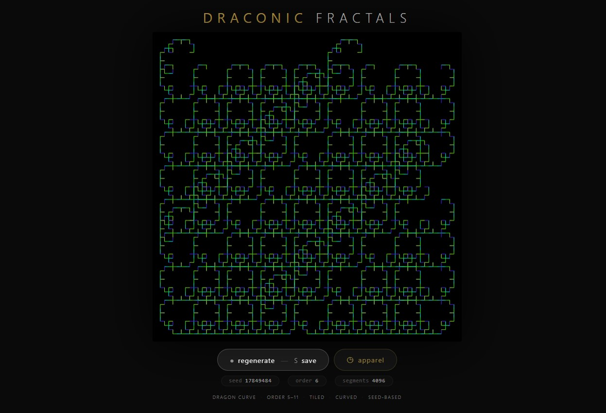
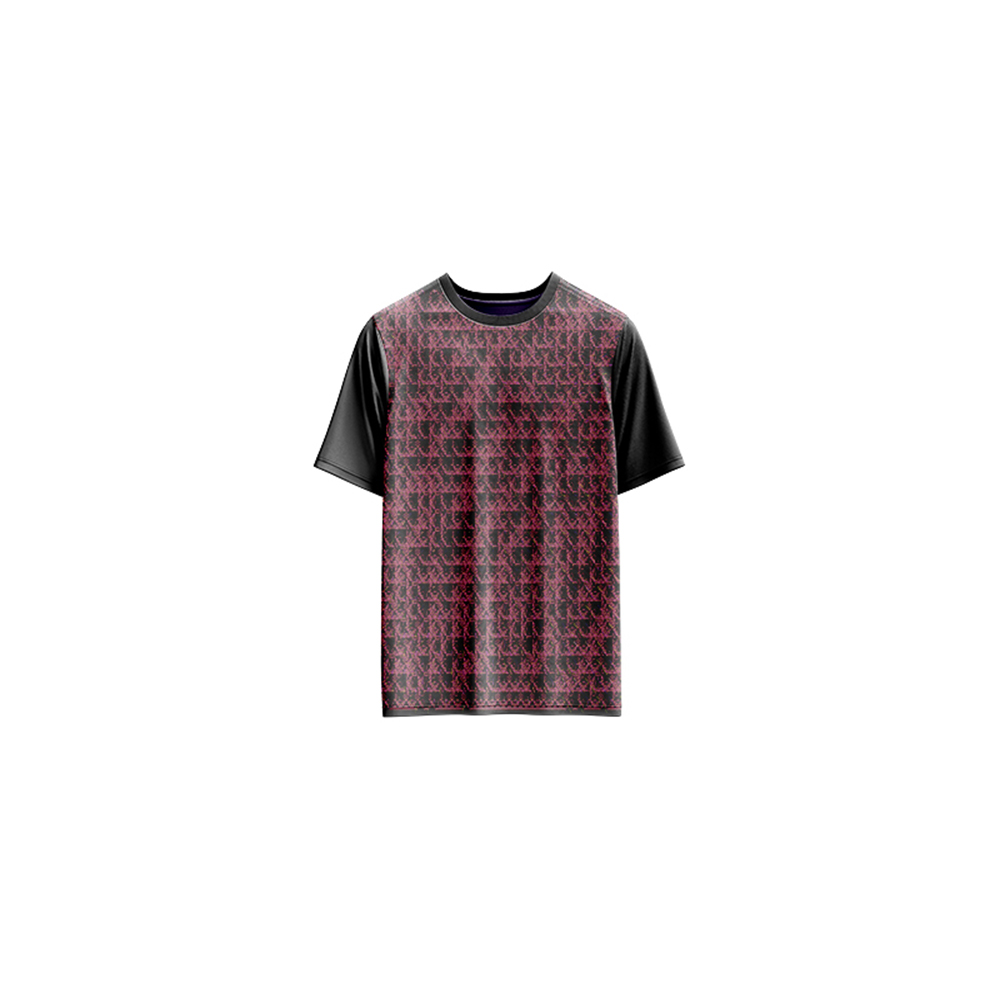

# Draconic Fractals — Generative Art

[](https://reyrove.github.io/Draconic-Fractals-Generative-Art)
[](https://opensource.org/licenses/MIT)

> **Generative dragon curve fractals.** Each refresh creates a unique tiled composition of the legendary Heighway dragon curve with colorful curved segments and infinite complexity.

## 🎨 Live Demo

<div align="center">
  <a href="https://reyrove.github.io/Draconic-Fractals-Generative-Art" target="_blank">
    
  </a>
  <br><br>
  <a href="https://reyrove.github.io/Draconic-Fractals-Generative-Art" target="_blank">
    
  </a>
  <br>
  <em>Click the image or button to experience the generative art</em>
</div>

## 👕 Apparel Preview

<div align="center">
  
  <br>
  <em>Draconic Fractals artwork printed on a T-shirt</em>
</div>

## ✨ Features

- **Dragon Curve** — Legendary Heighway dragon fractal
- **Tiled Composition** — Multiple dragon curves arranged in a grid
- **Smooth Curves** — Quadratic Bezier curves for elegant rendering
- **Color Palettes** — Random HSB color palettes
- **Infinite Complexity** — Fractal recursion with self-similarity
- **Seed-Based** — Every composition is unique and reproducible via its seed
- **Save & Share** — Download as PNG with seed in filename
- **Apparel Mode** — Preview artwork on a T-shirt mockup
- **Responsive** — Works on desktop, tablet, and mobile
- **Pure JavaScript** — No external dependencies
- **Keyboard Shortcuts**:
  - `R` — Regenerate
  - `S` — Save image
  - `T` — Toggle apparel view

## 🎨 Artwork Details

| Parameter | Range | Description |
|-----------|-------|-------------|
| **Fractal Order** | 5–11 | Recursion depth |
| **Tile Grid** | Up to 181×181 | Number of tiles |
| **Tile Skip** | 1–5 | Pattern variation |
| **Segments** | Thousands | Total curve segments |
| **Color Palettes** | 4 colors | Random HSB palettes |

## 🐉 The Dragon Curve

The Heighway dragon curve (also known as the Harter-Heighway dragon) is a fascinating fractal discovered by NASA physicists John Heighway and Bruce Banks. It's created by repeatedly folding a strip of paper in half and then unfolding it at right angles. The resulting curve exhibits self-similarity and infinite complexity.

### Dragon Curve Properties:
- Self-similar at all scales
- Never self-intersects
- Fills the plane as order approaches infinity
- Forms a space-filling curve

## 🚀 Quick Start

### Local Development

```bash
# Clone the repository
git clone https://github.com/reyrove/Draconic-Fractals-Generative-Art.git

# Navigate to the directory
cd Draconic-Fractals-Generative-Art

# Open in browser
open index.html
# or use a live server
```

### Deploy to GitHub Pages

1. Push to GitHub
2. Go to Settings → Pages
3. Select branch `main` and root folder
4. Your site will be live at `https://reyrove.github.io/Draconic-Fractals-Generative-Art`

## 🧠 How It Works

The artwork is generated using a deterministic random number generator, seeded by timestamp + random noise. Every refresh:

1. **Setup**:
   - Random fractal order (5-11)
   - Random tile skip pattern (1-5)
   - Random HSB color palette

2. **Fractal Generation**:
   - Dragon curve recursively generated
   - Each order adds more complexity
   - Tiled across the canvas

3. **Rendering**:
   - Black background
   - Each segment rendered as a quadratic Bezier curve
   - Random HSB colors from palette
   - Curves flow elegantly

## 📁 File Structure

```
Draconic-Fractals-Generative-Art/
├── index.html              # Main application (all-in-one)
├── Draconic-Fractals.jpg   # T-shirt mockup image
├── fav.svg                 # Favicon
├── demo-screenshot.jpg     # Website demo screenshot
├── README.md               # This file
└── LICENSE                 # MIT License
```

## 🛠️ Tech Stack

- **Pure Vanilla HTML/CSS/JS** — No dependencies
- **Canvas API** — 2D rendering
- **HSB Color Model** — Random color generation
- **CSS Flexbox/Grid** — Responsive layout
- **GitHub Pages** — Hosting

## 🎯 Interactive Controls

| Action | Keyboard | Button |
|--------|----------|--------|
| Regenerate | `R` | Click "regenerate" |
| Save Image | `S` | Click "regenerate" |
| Toggle Apparel | `T` | Click "apparel" |

## 🎨 The Creative Process

### Dragon Curve Generation
The dragon curve is generated recursively:
1. Start with a straight line segment
2. Replace it with two segments at right angles
3. Repeat recursively

### Tiling
Multiple dragon curves are arranged in a grid with alternating orientations, creating a complex, mosaic-like composition.

### Smooth Curves
Each segment is rendered as a quadratic Bezier curve, creating smooth, flowing lines instead of sharp corners.

### Color Palette
Random HSB color palettes create vibrant, harmonious color schemes that bring the fractal to life.

## 📱 Responsive Design

The application automatically adapts to:
- Desktop screens
- Tablets
- Mobile phones
- Landscape orientation
- Various aspect ratios

## 🤝 Contributing

Contributions are welcome! Feel free to:
- Fork the repository
- Create a feature branch
- Submit a pull request

### Ideas for Contributions:
- New fractal types
- Additional tiling patterns
- Animation features
- Color palette expansions
- Performance optimizations

## 📄 License

MIT License — see [LICENSE](LICENSE) file for details.

## 🙏 Acknowledgments

- Inspired by the Heighway dragon curve
- Pure JavaScript implementation
- Special thanks to the creative coding community

---

**Built with ❤️ and draconic recursion**